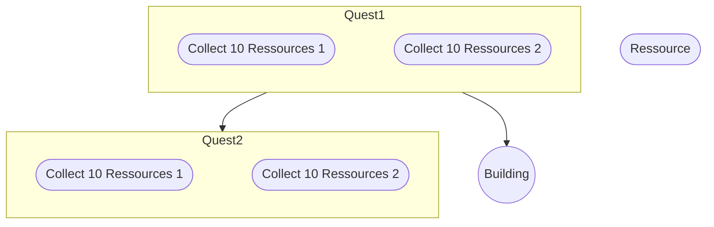
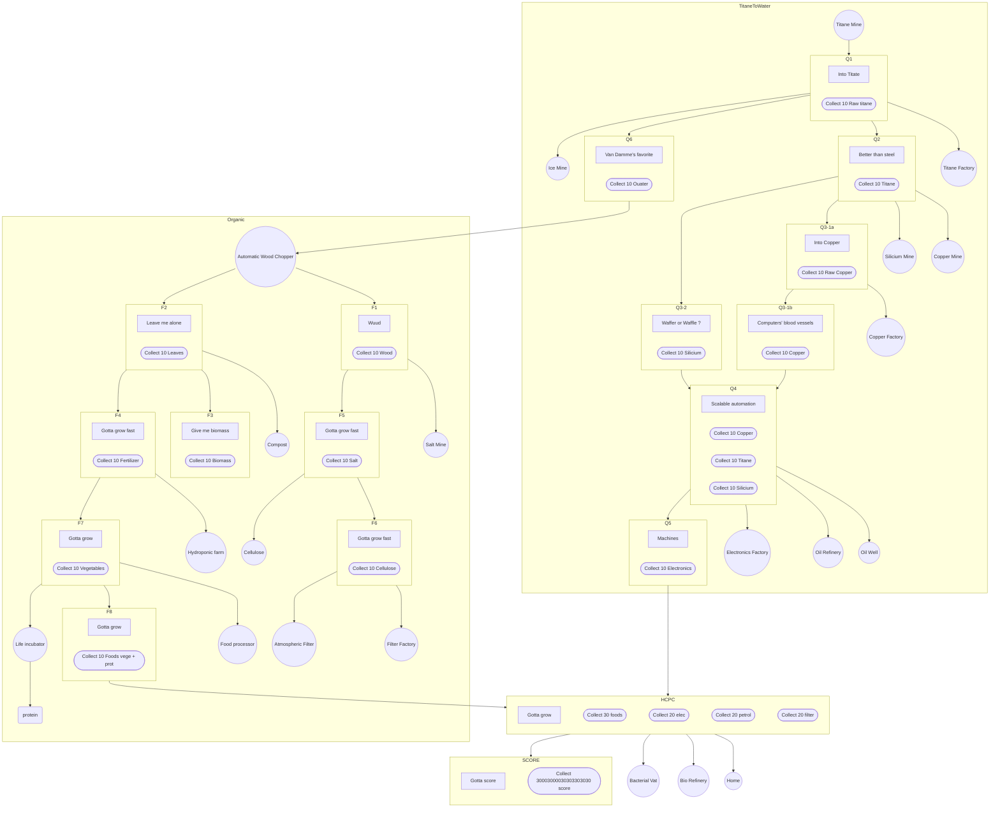

Scheme

```mermaid
flowchart
    subgraph Quest1
        R1([Collect 10 Ressources 1])
        R2([Collect 10 Ressources 2])
        R1 ~~~ R2
    end
    subgraph Quest2
             R3([Collect 10 Ressources 1])
        R4([Collect 10 Ressources 2])
        R3 ~~~ R4
    end
    Quest1 --> Quest2 & B
    R([Ressource])
    B((Building))
```

```mermaid
flowchart


    Home((Home))

    subgraph TitaneToWater
        TM((Titane Mine))
        TF((Titane Factory))
        CM((Copper Mine))
        CF((Copper Factory))
        SM((Silicium Mine))
        EF((Electronics Factory))
        OW((Oil Well))
    OR((Oil Refinery))

        subgraph Q1
            l1["Into Titate"]
            Q1r([Collect 10 Raw titane])
        end
        TM --> Q1
        subgraph Q2
            l2["Better than steel"]
            Q2r([Collect 10 Titane])
        end
        Q1 --> TF & Q2
        Q2 --> CM
        Q2 --> SM

        subgraph Q3-1a
            l31["Into Copper"]
            Q31r([Collect 10 Raw Copper])
        end
        Q3-1a --> CF
        subgraph Q3-1b
            l31b["Computers' blood vessels"]
            Q31rb([Collect 10 Copper])
        end
        Q3-1a --> Q3-1b
        subgraph Q3-2
            l32["Waffer or Waffle ?"]
            Q32r([Collect 10 Silicium])
        end
        Q2 --> Q3-1a & Q3-2
        subgraph Q4
            l4["Scalable automation"]
            Q4r1([Collect 10 Copper])
            Q4r2([Collect 10 Titane])
            Q4r3([Collect 10 Silicium])
        end
        Q4 --> OW & OR
        subgraph Q5
            l5["Machines"]
            Q5r([Collect 10 Electronics])
        end
        Q3-2 & Q3-1b --> Q4
        Q4 --> EF & Q5
        subgraph Q6
            l6["Van Damme's favorite"]
            Q6r1([Collect 10 Ouater])
        end
        Q1 --> Q6
        IM((Ice Mine))
        Q1 --> IM

    end

    subgraph Organic
        WWC((Automatic Wood Chopper))
        Carp((Cellulose))
        Com((Compost))
        FH((Hydroponic farm))
        SaM((Salt Mine))
        FP((Food processor))
        LI((Life incubator))
        SaM((Salt Mine))
        FF((Filter Factory))
        AF((Atmospheric Filter))


        Q6 --> WWC

        subgraph F1
            lF1["Wuud"]
            F1r1([Collect 10 Wood])
        end
        subgraph F2
            lF2["Leave me alone"]
            F2r1([Collect 10 Leaves])
        end
        subgraph F3
            lF3["Give me biomass"]
            F3r1([Collect 10 Biomass])
        end
        subgraph F4
            lF4["Gotta grow fast"]
            F4r1([Collect 10 Fertilizer])
        end

        subgraph F5
            lF5["Gotta grow fast"]
            F5r1([Collect 10 Salt])
        end
        subgraph F6
            lF6["Gotta grow fast"]
            F6r1([Collect 10 Cellulose])
        end
        subgraph F7
            lF7["Gotta grow"]
            F7r1([Collect 10 Vegetables])
        end
        subgraph F8
            lF8["Gotta grow"]
            F8r1([Collect 10 Foods vege + prot])
        end


        WWC --> F1 & F2
        F1 --> SaM
        F1 --> F5
        F2 --> Com
        F2 --> F3 & F4
        F4 --> FH
        F5 --> F6 & Carp
        F4 --> F7 --> FP & F8
        F7 --> LI
        LI --> a(protein)
        F6 --> FF & AF
    end


    subgraph HCPC
        HCP["Gotta grow"]
        HCP1([Collect 30 foods])
        HCP2([Collect 20 elec])
        HCP3([Collect 20 petrol])
        HCP4([Collect 20 filter])
        HCP ~~~ HCP1 ~~~ HCP2 ~~~ HCP3 ~~~ HCP4
    end

    BR((Bio Refinery))
    BV((Bacterial Vat))
    Q5 & F8 --> HCPC --> Home & BR & BV


    subgraph SCORE
        SC["Gotta score"]
        SC2([Collect 30003000030303303030 score])
        SC ~~~ SC2
    end
    HCPC --> SCORE

```
